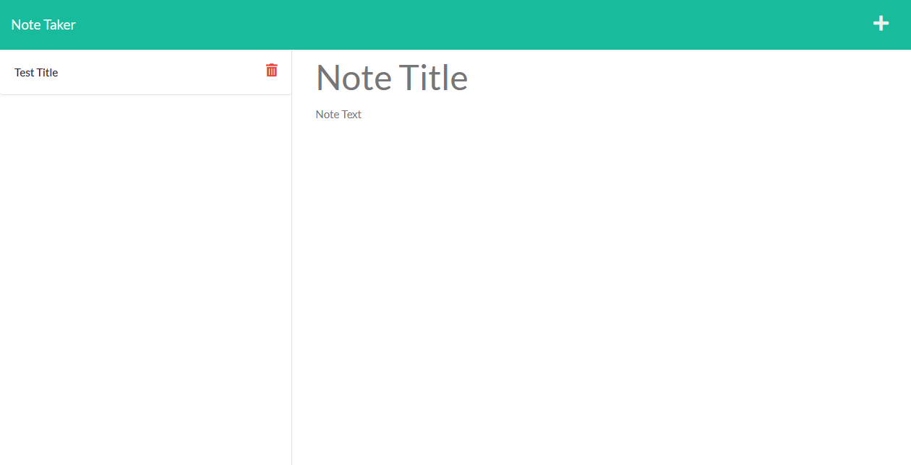
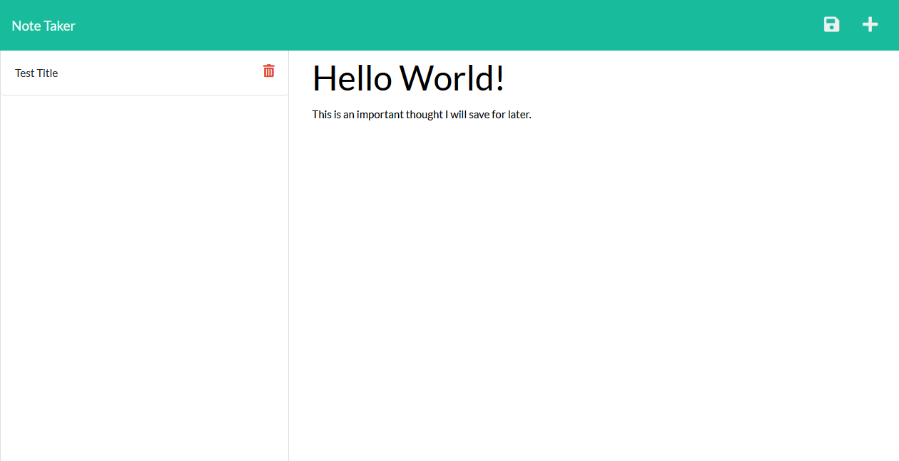

# Note-It: A Note-Taking App

## Description

This is an application that allows a user to insert and delete notes that they make. It has a back-end server to store the database with all their notes. This is so that the notes persist, unless specifically requested to be deleted by the user. 

> Github Repository Link: [https://github.com/Bickolus/note-it](https://github.com/Bickolus/note-it)
>
> Deployed Link: https://note-it-by-bilal.herokuapp.com/

## Table of Contents

1. [Installation](#installation)
2. [Usage](#usage)
3. [Example](#example)
3. [License](#license)
4. [Tests](#tests)
5. [Questions](#questions)

## Installation

Type "npm install" in the console to install the dependancies this application requires (Express and Path). Alternatively, just use the app in the Heroku link. 

## Usage

In order to run this program on your local machine, the user must type "node server.js" in their console for the server to deploy at http//localhost:3001/. 

## Example

### Screenshots of the Application

## License

This project is not under any license.

## Questions

My GitHub Page: [Bickolus](https://github.com/Bickolus)

If you have any additional questions, please contact me at smbraza97@gmail.com.
